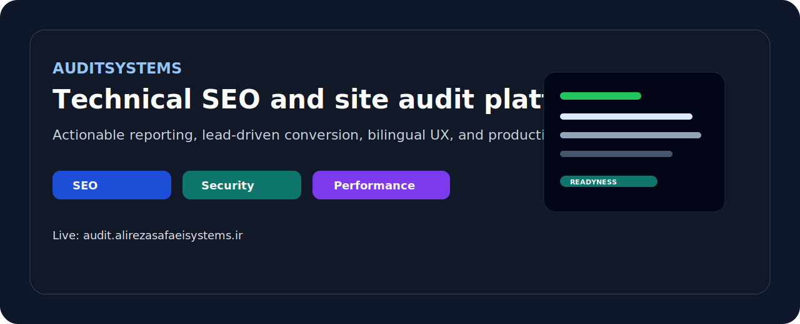

# AuditSystems

<p align="center">
  
</p>

Technical SEO, performance, security, and resilience audit platform built to turn website issues into actionable reports and qualified leads.

[Live platform](https://audit.alirezasafaeisystems.ir) - [Portfolio hub](https://alirezasafaeisystems.ir)

## What This Project Does

`auditsystems` is a production-focused audit service for websites that need more than a vague score.

It is designed to:

- analyze site readiness across SEO, performance, security, and reliability
- generate reportable outputs that can be shared with clients or stakeholders
- support a service-led conversion flow from audit to project inquiry
- run in a practical local-first setup with reduced platform dependency

## Why It Matters

Most audit tools stop at generic metrics.

This project is built around a stronger business outcome:

- surface meaningful technical issues
- make them understandable
- connect findings to remediation work
- turn the audit itself into a high-trust entry offer

## Core Capabilities

- website audit workflow with actionable reporting
- bilingual product surface with `fa/en` and RTL/LTR support
- queue-backed worker processing
- production readiness checks for payment, docs, and release flow
- liveness and readiness endpoints for operational visibility

## Stack

- Next.js App Router
- TypeScript
- Prisma
- PostgreSQL
- worker pipeline backed by database queueing
- Vitest and ESLint

## Project Role in Portfolio

This repository demonstrates:

- technical SEO product thinking
- service packaging through software
- full-stack implementation with operational awareness
- practical delivery under real deployment constraints

## Live Surface

- App: `https://audit.alirezasafaeisystems.ir`
- health endpoints:
  - `GET /api/live`
  - `GET /api/ready`

## Quick Start

### Prerequisites

- Node.js
- `pnpm`
- PostgreSQL

### Install

```bash
pnpm install
cp .env.example .env
```

### Database

Set a valid `DATABASE_URL`, then run:

```bash
pnpm run db:migrate
pnpm prisma generate
```

### Run the app

```bash
pnpm run dev
```

### Run the worker

```bash
pnpm run worker:dev
```

## Quality Gates

Full verification:

```bash
pnpm run check
```

That runs:

- lint
- typecheck
- test
- build

Useful focused commands:

```bash
pnpm run payment:preflight
pnpm run payment:zarinpal:smoke
pnpm run automation:run
pnpm run lighthouse:local
```

## Environment Highlights

Important runtime variables include:

- `DATABASE_URL`
- `APP_BASE_URL`
- `APP_BASE_URL_STRICT`
- `AUDIT_DNS_GUARD`
- `WORKER_POLL_MS`
- `WORKER_JOB_TIMEOUT_MS`
- `IP_HASH_SALT`
- `NEXT_PUBLIC_GA4_MEASUREMENT_ID`

See `.env.example` for the working set.

## Deployment Notes

- production deployment is designed for real VPS usage
- official no-docker deployment guidance lives in `docs/DEPLOYMENT_NO_DOCKER.md`
- runtime support files are available in `ops/systemd/*` and `ops/pm2/ecosystem.config.cjs`

## Documentation

- docs index: `docs/README.md`
- routes and page map: `docs/ROUTES_NEXTJS.md`
- SSRF and hardening notes: `docs/SECURITY_SSRF.md`
- worker runbook: `docs/WORKER_RUNBOOK.md`
- phased roadmap: `docs/PHASES.md`
- release runbook: `docs/RELEASE_RUNBOOK.md`
- rollback runbook: `docs/ROLLBACK_RUNBOOK.md`

## Positioning

If you need a technical audit platform, a service-led SEO workflow, or a production-ready website analysis system, this repository shows how I approach the problem from architecture to operations.
