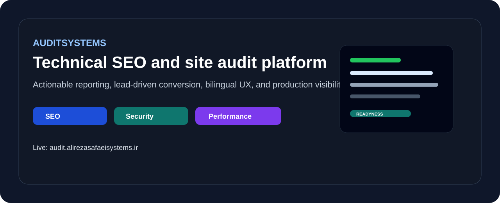

<div align="center">

  

  <br/>

  <h1>AuditSystems</h1>
  <p><strong>Technical SEO & Website Audit Platform</strong></p>
  <p>بستر حرفه‌ای ممیزی فنی سئو و وبسایت</p>

  <p>
    <a href="https://github.com/alirezasafaei-dev/auditsystems/actions"></a>
    <a href="https://github.com/alirezasafaei-dev/auditsystems/blob/main/LICENSE"></a>
    <a href="https://nextjs.org"></a>
    <a href="https://www.typescriptlang.org"></a>
    <a href="https://prisma.io"></a>
    <a href="https://vitest.dev"></a>
    <a href="https://playwright.dev"></a>
    <a href="https://github.com/alirezasafaei-dev/auditsystems/pulls"></a>
  </p>

  <h3>
    <a href="https://audit.alirezasafaeisystems.ir">Live Demo</a>
    <span> · </span>
    <a href="#-quick-start">Quick Start</a>
    <span> · </span>
    <a href="#-architecture">Architecture</a>
    <span> · </span>
    <a href="#-testing">Testing</a>
    <span> · </span>
    <a href="#-contributing">Contributing</a>
  </h3>

</div>

---

## ✨ Overview

AuditSystems is a full-featured, production-grade technical SEO and website audit platform. It runs deep automated scans — from server response analysis and canonical checks to Lighthouse performance scoring, WCAG accessibility validation, and competitive benchmarking — then generates actionable, beautifully formatted PDF reports.

Built for SEO professionals, agencies, and website owners who need reliable, repeatable, and insightful audits at scale.

---

## 🖼️ Screenshots

> _Dashboard interface — coming soon._


---

## 🚀 Features

<table>
  <tr>
    <td width="33%">
      <h3>🔍 Technical SEO</h3>
      <p>Server response analysis, redirect chain detection, canonical tag validation, robots.txt and sitemap parsing, structured data inspection, and hreflang checks.</p>
    </td>
    <td width="33%">
      <h3>⚡ Performance</h3>
      <p>Lighthouse integration with Core Web Vitals (LCP, CLS, FID/INP), page speed scoring, resource waterfall, and performance budget enforcement.</p>
    </td>
    <td width="33%">
      <h3>📄 Content Analysis</h3>
      <p>Duplicate content detection, thin content identification, keyword density, heading structure, image alt coverage, and readability scoring.</p>
    </td>
  </tr>
  <tr>
    <td width="33%">
      <h3>🏆 Competitor Benchmarking</h3>
      <p>Compare your site against competitors across SEO, performance, and content metrics. Track positioning over time with automated snapshots.</p>
    </td>
    <td width="33%">
      <h3>📑 PDF Reporting</h3>
      <p>Auto-generated, professionally branded PDF reports with executive summaries, scorecards, issue prioritization, and remediation guidance.</p>
    </td>
    <td width="33%">
      <h3>♿ Accessibility</h3>
      <p>WCAG 2.2 compliance checks (A, AA, AA+AA levels), contrast ratio validation, ARIA attribute testing, and keyboard navigation audits.</p>
    </td>
  </tr>
  <tr>
    <td width="33%">
      <h3>🔧 Background Workers</h3>
      <p>Dedicated worker system for async job processing — audit runs, report generation, scheduled scans, and notifications without blocking the UI.</p>
    </td>
    <td width="33%">
      <h3>🌐 Bilingual UX</h3>
      <p>Full Persian and English interface with i18n support. Right-to-left (RTL) layout for Persian users. Locale-aware URLs and SEO metadata.</p>
    </td>
    <td width="33%">
      <h3>🛡️ Security</h3>
      <p>Session-based auth with httpOnly cookies, CSRF protection, rate limiting, Prisma parameterized queries, and environment-gated secrets.</p>
    </td>
  </tr>
</table>

---

## 🛠️ Tech Stack

| Layer | Technology |
|---|---|
| **Framework** | [Next.js 16](https://nextjs.org) (App Router, server components, streaming SSR) |
| **Language** | [TypeScript 6](https://www.typescriptlang.org) (strict mode, `noUncheckedIndexedAccess`) |
| **Database** | [PostgreSQL](https://postgresql.org) + [Prisma 6](https://prisma.io) ORM |
| **Styling** | [Tailwind CSS 4](https://tailwindcss.com) + [shadcn/ui](https://ui.shadcn.com) |
| **Testing** | [Vitest 4](https://vitest.dev) (unit + integration) · [Playwright](https://playwright.dev) (e2e + a11y) |
| **PDF** | [pdf-lib](https://pdf-lib.org) — server-side PDF generation |
| **Parsing** | [Cheerio](https://cheerio.js.org) — HTML parsing and scraping |
| **Auth** | Session-based (httpOnly cookies, CSRF double-submit cookie pattern) |
| **Container** | [Docker](https://docker.com) · [docker-compose](https://docs.docker.com/compose) |
| **Deployment** | VPS (Nginx + systemd + standalone Next.js output) |

---

## 🚀 Quick Start

### Prerequisites

- **Node.js** 22+ | **pnpm** 9+
- **PostgreSQL** 16+ (or use `docker compose up -d`)
- **Git**

### Setup

```bash
# 1. Clone the repository
git clone https://github.com/alirezasafaei-dev/auditsystems.git
cd auditsystems

# 2. Install dependencies
pnpm install

# 3. Configure environment
cp .env.example .env
# Edit .env — set DATABASE_URL, SESSION_SECRET, and other keys

# 4. Start PostgreSQL (Docker)
docker compose up -d

# 5. Apply database migrations
pnpm db:migrate

# 6. Start the development server
pnpm dev
```

Open [http://localhost:3000](http://localhost:3000) in your browser.

### Production Build

```bash
pnpm build
pnpm start
```

---

## 🏗️ Architecture

```
auditsystems/
├── src/
│   ├── app/              # Next.js App Router (pages, API, layouts)
│   ├── components/       # React components (UI, sections, layout)
│   ├── lib/              # Core utilities (auth, db, plans, validators)
│   ├── worker/           # Background job processor (async audit runs)
│   ├── scripts/          # Automation scripts (roadmap, SEO, docs, payment)
│   ├── content/          # Static content and localization data
│   ├── fixtures/         # Test fixtures and mock data
│   ├── middleware.ts     # Next.js middleware (i18n, auth, security)
│   └── __tests__/        # Test suites
├── prisma/               # Database schema and migrations
├── scripts/              # Deployment, smoke tests, ops scripts
├── docs/                 # Documentation
├── assets/               # Brand assets (SVG previews, logos)
└── ops/                  # Operational runbooks and configs
```

**Data flow**: A user triggers an audit → API route enqueues a job → Worker picks it up → Scrapes & analyzes the target → Writes results to PostgreSQL → Generates PDF → Notifies user. All async, non-blocking, and queued.

**Key design decisions**:
- **Prisma** for type-safe database access with full migration management
- **Workers** decouple heavy processing from the request-response cycle
- **Next.js 16 App Router** for server components, streaming, and edge-ready middleware
- **Session auth** with CSRF protection for secure multi-tenant use

---

## 🧪 Testing

```bash
# Run all tests
pnpm test

# Watch mode
pnpm test:watch

# With coverage
pnpm test:coverage

# Full quality check (lint + typecheck + test + build)
pnpm check

# Smoke test public routes
pnpm smoke:routes
```

Tests are co-located with source files (e.g. `src/lib/auth.test.ts` alongside `src/lib/auth.ts`).

---

## 📦 Scripts

| Script | Purpose |
|---|---|
| `pnpm dev` | Start development server |
| `pnpm build` | Production build |
| `pnpm lint` | ESLint (zero-warning policy) |
| `pnpm typecheck` | TypeScript strict check |
| `pnpm db:studio` | Prisma Studio — data browser |
| `pnpm worker:dev` | Start background worker |
| `pnpm seo:audit` | Run SEO audit automation |
| `pnpm docs:refresh` | Regenerate docs + roadmap |
| `pnpm smoke:routes` | Validate all public routes |
| `pnpm deploy:production` | Deploy to production VPS |

---

## 🤝 Contributing

We welcome contributions! Please see [CONTRIBUTING.md](CONTRIBUTING.md) for detailed guidelines.

**Quick rules**:
- TypeScript strict — no `any`
- ESLint must pass with zero warnings
- All tests must pass (`pnpm check`)
- Co-locate tests with source code
- Use [conventional commits](https://www.conventionalcommits.org)

---

## 📄 License

[MIT](LICENSE) © 2026 [Alireza Safaei](https://github.com/alirezasafaei-dev)

---

<div align="center">
  <sub>
    Built with Next.js · TypeScript · Prisma · Tailwind CSS<br/>
    <a href="https://audit.alirezasafaeisystems.ir">audit.alirezasafaeisystems.ir</a>
  </sub>
  <br/><br/>
  <sub>
    <a href="https://github.com/alirezasafaei-dev">@alirezasafaei-dev</a>
    <span> · </span>
    <a href="https://alirezasafaeisystems.ir">alirezasafaeisystems.ir</a>
  </sub>
</div>
